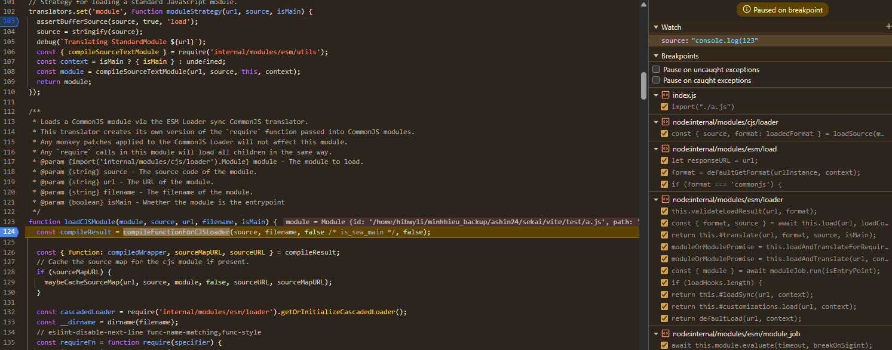

# Prototype pollution to RCE gadget in node js newest with module imports 
- A Prototype pollution gadget in newest node js (v24.6.0): 
Example : 


Package.json : 
```json 
{
  "name": "test",
  "version": "1.0.0",
  "description": "",
  "license": "ISC",
  "author": "",
  "type": "commonjs",
  "main": "index.js",
  "scripts": {
    "test": "echo \"Error: no test specified\" && exit 1"
  }
}
```

- Note : this just works if the type is "commonjs" or "module" . And the javascript stored in "a.js" wont be executed .

# Let's debug 
- To understand the flow of the import module i have a simple crash here : 
```js 
Object.prototype.source = "console.log(123"
import("./a.js")
```


- So put those breakpoint on the debugger and see how it works . You can use 
```sh    
    node --inspect-brk index.js
```
First when i read the import('a.js') it will do a bunch of stuffs to convert that in to form "file:///" then it will apply a loadContext 

- It will do some  stuffs here to check what source should be  : 


The **format** variables basically is the "type" in the package.json. So if the format is not set , it will fallback to set the format into "commonjs" and the **source** into null (we dont want this happen right ?). 

Then it will check if source is null or not to fetch to "a.js" file to read the source and put it back .

- The vulnearbilites here is that if we have prototype pollution, the source here get controlled. And the "??" will use our source instead .
Finally  that source will go through so much stuffs but not get overwrited anywhere more .


Final source will be put into loadCJS 

Then get compiled with **compileFunctionForCJSLoader**

(you can see that source is our payload but not the a.js)

The compileFunctoinForCJSLoader will compile our source as a string 
https://github.com/nodejs/node/blob/main/src/node_contextify.cc


# Conclusion 
- This gadget is too hard to find out and i dont really understand how the Sekai Guys can find it too good. Maybe use some fuzzer but btw now i understand it a little bit .